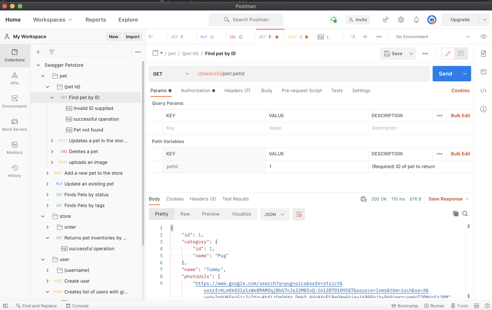

# Postman Research

## Overview
[Postman](https://www.postman.com) is a collaboration platform for API development, teams can easily join the website and work to create, document, and test their APIs. It is a bit more clean in terms of design than Swagger and offers many of the features Swagger lacks, but does not allow for the editing of the Postman tool's code.

## Available Features

Quick Rundown:
- Postman has built—in support for popular data formats such as OpenAPI, GraphQL, and RAML. Also works, though not as well with JSON and YAML.
  - Import a singular API (request) from a YAML or JSON formatted file.
  - Import a Collection using these formats or a link, though errors may arise if not in the exact format Postman expects.
    - Postman Collections are sets of organized API calls!
  - When you import an API or collection from a YAML file you can then add a brief summary with an accompanying more in-depth description of the API (in markdown).
- *Has a "Try it Out" or essentially a test/run the API feature.*
- Can expand/collapse specific blocks of code or requests.
- *Has a search feature.*
- *Offers version control for APIs.*
- Postman offers a [GitHub Organization](https://github.com/postmanlabs) where one can find documentation about using Postman, find repositories helpful for API creation/testing, and find tools that help convert certain data types to ones that will work with Postman. This organization does not actually have the Postman tool itself.

### Features Missing Currently In Swagger

There are a variety of features that Postman has that Swagger is missing:
- Postman has an online UI for developers to update their APIs easily, without any backend work.
- *Postman has version control for APIs.*
- Has more of a deep search functionality, though I feel it is far from perfect while being better than what is currently offered by Swagger.
- Cleaner design.
- Easy-to-use website UI that allows API developers to update things right on the web.
- Automated testing for APIs.
  - Perform a full-system or full-collection test. Run everything, not just specific collection components.
    - Manually or automated.

## Pros / Cons
### Pros:

- Free!
- Import APIs or collections from other formats.
- Version control for APIs.
- Better and easier to use API tester/runner.
- Has a form of a search feature.
- All API updates can be performed easily online using the Postman website or App.

### Cons:

- No full-featured Expand or Collapse, can just do it on specific code blocks or request groups, not all entities.
- More support for JSON than YAML files.
- Even when it converts the JSON file for say the Swagger Petstore example to a Postman collection, it does not carry over the descriptions from Swagger. This means that one would have to go back to the Swagger UI and manually add these descriptions for different requests or portions of the project.
- It has a search feature but it is far from a deep search. Using relevant search queries for a multitude of requests, the search query was only able to return one or two that had the word being queried in the title it seems.
- It is open-source but not open-source. The organization has a ton of open-source content related to the tool, but you cannot view the code of the Postman tool itself or edit it.
  - Would make it harder to improve upon Postman's current search feature or to add a full-featured expand/collapse option.

## Main Takeaways
Postman is essentially the free version of README.io in terms of its clean and easy to use design. It is online based and can take a number of data formats for importation.

It contains key features like a try/test feature, a basic search feature, version control, and more. Everything Swagger has and more.

It is not editable, however, as the Postman tool itself is not open source. This would make it hard to improve upon the search feature to make it a deep search feature and hard to fix up the expand/collapse feature so it works with everything.
